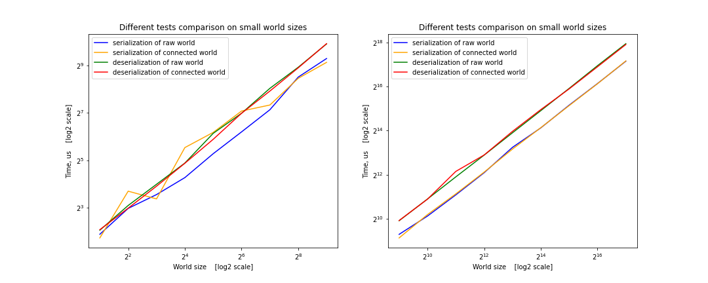
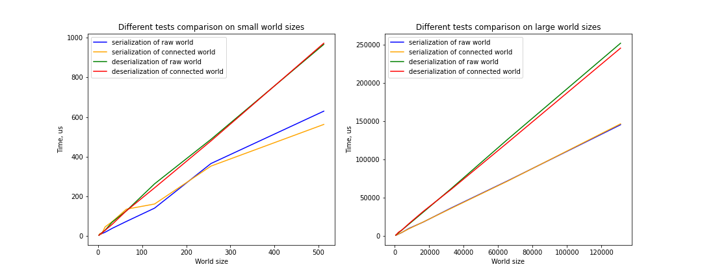
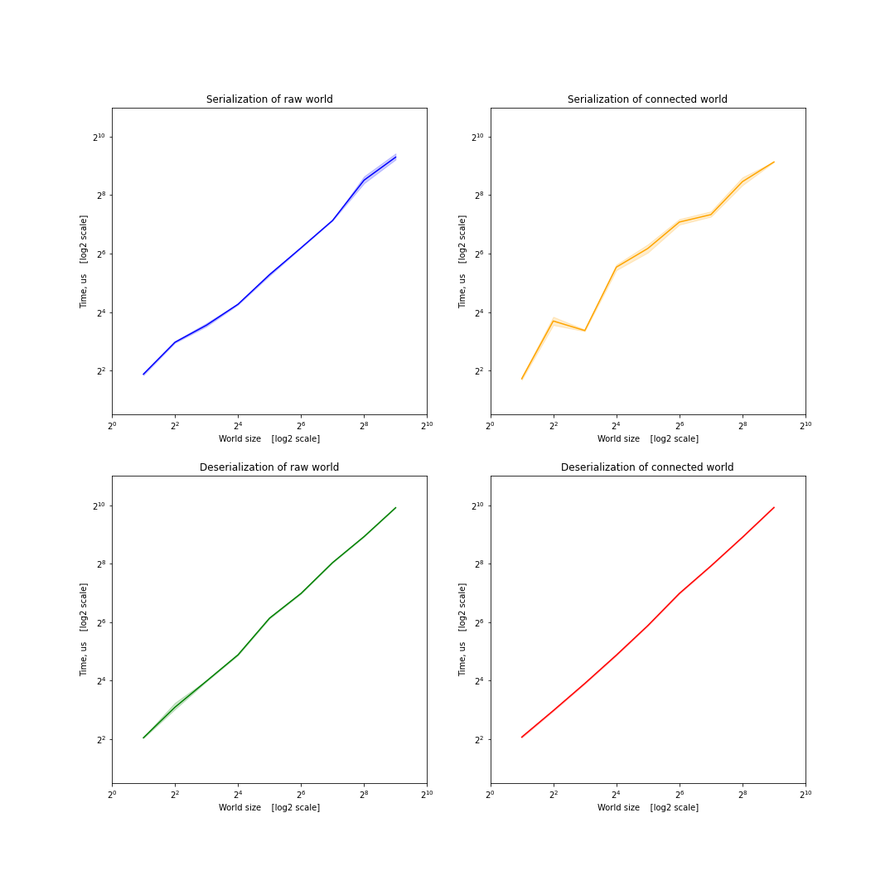
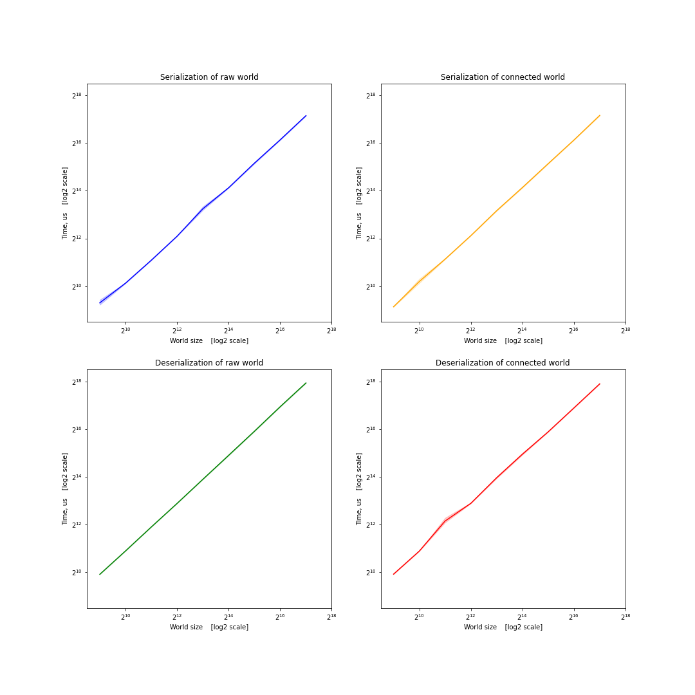

# Персистентный мир

### Формулировка задачи
Люди исследуют планеты, соединённые порталами. Каждый портал двусторонний и соединяет две планеты.
Планета характеризуется именем, цветом и имеющимися на ней порталами (минимум 1).
Каждый портал соединён с порталом на другой планете, соединения двунаправленные и стабильные,
но до первого прохода через портал его местоназначение неизвестно.
Игрок начинает на домашней планете. Попадая на планету, разведка предоставляет все её характеристики.
Каждый ход игрок указывает, в какой портал идёт дальше. Первый проход через не исследованный портал
может вывести на один из не исследованных порталов на других известных планетах, или на новую планету.
Реализовать путешествие по подобным образом устроенному миру с возможностью выхода из программы
с сериализацией известной части мира в файл, чтобы десериализовать при следующем запуске.

### Используемые библиотеки:

* [libnop](https://github.com/google/libnop)
* [catch2](https://github.com/catchorg/Catch2/blob/devel/docs/benchmarks.md)

## Сборка и запуск

#### Скачивание зависимостей
```sh
git clone https://github.com/Astrarog/hse-serialization.git
cd hse-serialization
```
Если у Вас в системе не имеется используемых библиотек, или Вы не хотите использовать их, то команды используйте команды ниже, чтобы получить необходимые зависимости.  

```sh
git submodule init
git submodule update
```

#### Сборка проекта
```sh
cmake -B build 
cmake --build build
```

#### Запуск интеррактивной версии
```sh
cd build
./hse-serialization-game
```

#### Запуск тестов на производительность
```sh
cd build/test
./hse-serialization-test [OPTIONS]
```
`[OPTIONS]` - теги тестов и опциональные параметры полученные от [catch2](https://github.com/catchorg/Catch2/blob/devel/docs/command-line.md)


## Результаты
 
#### Описание решения
В ходе решения задачи было обнаружено, что libnop не поддерживает сериализацию структур с указателями. Всвязи с этим порталы были реализованы в виде индексов в некотором массиве-галактике. Была реализована интерактивная игра с возможностью сохранения прогресса и выбором типа мира: конечный или потенциально бесконечный. Были написаны тесты по замеру производительности сериализации/десериализации миров размеров 2<sup>1</sup>,2<sup>2</sup>,...,2<sup>17</sup> как для полностью сгенерированного мира (_connected_), так и для мира в котором планеты ещё не были связаны порталами (_raw_). Ниже приведены графики как в логарифмическом масштабе, так и в обчном для наглядности. 

#### Полученные результаты
##### Все тесты на одном графике в логарифсической шкале

##### Все тесты на одном графике в обычной шкале

##### Динамика изменения каждого теста на мирах малого размера с доверительными интервалами

##### Динамика изменения каждого теста на мирах большого размера с доверительными интервалами

